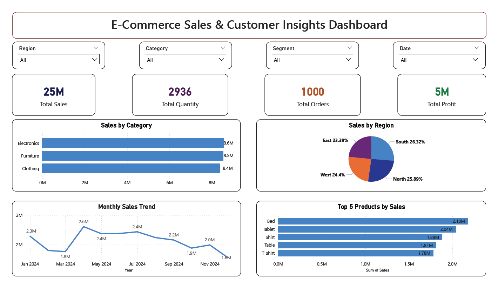

# E-commerce Sales Analysis

## Tools Used
- SQL Server
- Power BI

## Dashboard Preview

## Project Description
This project analyzes e-commerce sales data using SQL and Power BI to identify trends, product performance, and regional insights.

## Key Insights
- Sales peaked in April indicating high demand
- Sales declined after September due to seasonal slowdown
- Mid-year performance remained stable
- Key categories contribute major revenue
- Top products drive most sales

## Files
- Power BI Dashboard (.pbix)
- SQL Queries (.sql)

This project demonstrates end-to-end data analysis including data extraction, transformation, visualization, and business insight generation.
